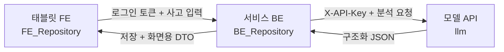

# FE·BE·모델 API 연동 및 병합 계약

## 1. 가장 쉬운 설명

세 저장소의 코드를 한 저장소에 물리적으로 합치는 구조가 아닙니다. 각 저장소에서 담당 기능을
PR로 병합하고, 배포된 서비스끼리 아래 순서로 통신합니다.



FE가 모델 API를 직접 부르면 안 됩니다. 모델 API 키가 브라우저에 노출되고 사고 기록·현장
확인 레코드의 권한 검증을 우회할 수 있기 때문입니다.

## 2. 저장소별 책임

| 저장소 | 담당 | 담당하지 않는 것 |
|---|---|---|
| `FE_Repository` | 태블릿 UI, 사용자 입력, 분석 상태 표시 | 모델 API Key, CAMEO 판정 |
| `BE_Repository` | 로그인, 사고 CRUD, 현장 확인 기록, AI 호출·저장 | 위험등급 임의 계산 |
| `llm` | 구조화·검색·규칙 검토·근거와 버전 반환 | 사용자 로그인, 사고 영구 저장 |

기계 판독 가능한 같은 내용은
[`contracts/model-api-integration-v1.json`](../contracts/model-api-integration-v1.json)에
고정합니다.

## 3. 실제 호출 순서

### 3.1 현장 확인 전

1. FE가 신고문·위치·검토 중 대응을 BE에 보냅니다.
2. BE가 사고 레코드를 만들고 자체 `incident_id`를 발급합니다.
3. BE가 `POST /api/v1/incidents/analyze`를 호출합니다.
4. AI가 물질 후보, 시설 이력 후보, 근거와 `confirmation_gate`를 반환합니다.
5. BE가 원본 응답과 `analysis_id`, `request_id`, 모델·데이터 버전을 저장합니다.
6. FE는 후보와 “현장 확인 필요” 상태만 표시합니다.

이 단계에서는 `risk_level_ko`, 구체적 반응과 AI 대응 권고를 표시하지 않습니다.
시설 이력은 현재 재고가 아니라 **과거 공개 이력 기반 시설물질 후보**입니다. 사용자가 입력한
`planned_actions`도 AI가 검증한 대응 권고가 아닙니다.

### 3.2 물질 두 개를 현장에서 확인한 뒤

1. 대원이 용기 라벨·현장 MSDS 등으로 사고물질과 시설물질을 확인합니다.
2. BE가 인증 사용자와 확인 시각을 포함한 서로 다른 확인 레코드 두 개를 저장합니다.
3. BE가 두 `confirmed_*_substance` 객체를 포함해 통합 API를 다시 호출합니다.
4. AI는 CAMEO 공개 근거 정책으로 결정론적 충돌 검토를 실행합니다.
5. FE는 `risk_scale.is_probability=false`를 지키고 서수 등급을 백분율로 바꾸지 않습니다.

전문가 사전 승인은 이 API 실행 조건이 아닙니다. 대신 공개 근거 파일럿 결과에는
`expert_reviewed=false`가 유지되며 최종 판단은 현장 지휘관에게 있습니다.

## 4. BE가 호출할 모델 API

운영 기본 연동점은 하나입니다.

```text
POST {CHEMICHECK119_MODEL_API_BASE_URL}/api/v1/incidents/analyze
X-API-Key: {CHEMICHECK119_MODEL_API_KEY}
X-Request-Id: {BE가 생성한 추적 ID}
Content-Type: application/json
```

BE 환경변수 권장 계약:

```text
CHEMICHECK119_MODEL_API_BASE_URL=https://내부-모델-api
CHEMICHECK119_MODEL_API_KEY=32자-이상-배포-secret
CHEMICHECK119_MODEL_API_SCHEMA=chemiguard119-api-v1
CHEMICHECK119_MODEL_API_CONNECT_TIMEOUT_SECONDS=2
CHEMICHECK119_MODEL_API_RESPONSE_TIMEOUT_SECONDS=15
```

API Key는 `.env` 예제에 실제 값을 쓰지 않고 배포 플랫폼의 Secret으로 주입합니다.

## 5. BE 요청 예시

```json
{
  "request_id": "REQ-BE-20260728-0001",
  "incident_id": "INC-BE-20260728-0001",
  "input": {
    "type": "DISPATCH_TEXT",
    "text": "차아염소산나트륨 저장탱크에서 누출이 의심됩니다.",
    "occurred_at": "2026-07-28T17:30:00+09:00"
  },
  "location": {
    "address": "경기 화성시 팔탄면",
    "province": "경기도",
    "facility_name": "예시 사업장"
  },
  "planned_actions": [
    {
      "raw_text": "누출구역 통제 검토"
    }
  ],
  "evidence_top_k": 5
}
```

정확한 전체 요청은
[`examples/api/incident_unconfirmed_request.json`](../examples/api/incident_unconfirmed_request.json),
확인 후 요청은
[`examples/api/incident_confirmed_request.json`](../examples/api/incident_confirmed_request.json)을
사용합니다.

확인 전 대시보드의 안전한 응답 fixture는
[`examples/api/incident_unconfirmed_response.json`](../examples/api/incident_unconfirmed_response.json)
입니다. FE·BE는 이 fixture를 mock과 계약 테스트에 사용할 수 있습니다.

## 6. BE 저장 최소 필드

모델 응답 전체를 감사용 JSON으로 보관하되 최소한 다음 필드를 별도 조회 가능하게 저장합니다.

| 필드 | 이유 |
|---|---|
| `incident_id` | 서비스 사고와 연결 |
| `analysis_id` | 분석 실행 식별 |
| `request_id` | 세 서비스 로그 연결 |
| `state` | 화면·재시도 상태 |
| `schema_version` | 계약 호환성 |
| `input_fingerprint` | 같은 입력인지 확인, 원문 대체용 아님 |
| `provenance` | 모델·데이터·정책 버전 |
| `confirmation_gate` | 충돌 검토 실행 조건 감사 |
| `created_at` | BE 저장 시각 |

후보 점수는 확률 컬럼에 저장하지 않습니다. 시설 이력 후보도 현재 재고 테이블로 승격하지
않습니다.

## 7. FE에 내려줄 상태

BE는 HTTP 성공 여부와 모델 워크플로 상태를 분리합니다.

| AI 결과 | BE가 FE에 전달할 의미 |
|---|---|
| `AWAITING_SUBSTANCE_CONFIRMATION` | 사고·시설물질 후보 표시, 두 확인 입력 요청, 위험 카드 잠금 |
| `AWAITING_INCIDENT_CONFIRMATION` | 사고물질 확인 입력 요청, 위험 카드 잠금 |
| `AWAITING_FACILITY_CONFIRMATION` | 시설물질 확인 입력 요청, 위험 카드 잠금 |
| `COMPLETED` 또는 스크리닝 완료 상태 | 근거·서수 위험등급·우선 확인 표시 |
| `UNCLASSIFIED` | 근거 부족, 외부 MSDS 확인 안내 |
| `CAS_EVIDENCE_NOT_LOADED` | 다른 물질 근거로 대체하지 않고 상세 근거 미적재 표시 |
| HTTP `401` | 사용자 오류가 아니라 서버 인증 구성 장애 |
| HTTP `422` | FE 자유 문구가 아니라 BE→AI 계약 오류로 기록 |
| HTTP `503` | 준비 전·일시 장애. 응답의 `retryable` 확인 |

FE는 `schema_version`, `state`, `confirmation_gate`, `conflict_review`,
`required_next_steps`, `safety_notice`가 없는 성공 응답을 정상 결과로 표시하지 않습니다.

### 7.1 대시보드 표시 규칙

현재 디자인의 “대응충돌검토 결과” 영역은 API 상태에 따라 완전히 다른 카드로 렌더링해야
합니다.

| 조건 | 제목 | 표시 | 숨김 |
|---|---|---|---|
| 확인 전 | 물질 후보 확인 필요 | 신고문 후보, 과거 이력 후보, 확인 버튼 | 위험등급, 반응, 대응 권고 |
| 한 물질만 확인 | 추가 물질 확인 필요 | 확인된 CAS, 남은 확인 역할 | 위험등급, 반응, 대응 권고 |
| 두 물질 확인 + 규칙 실행 | 대응충돌검토 결과 | 서수 등급, 반응, 근거 URL·버전 | 확률·백분율 |
| 두 물질 확인 + 근거 부족 | 공개 근거 부족 | 확인된 두 CAS, 추가 확인 안내 | 임의 위험등급 |

기계 판독 가능한 원본은
[`contracts/model-api-integration-v1.json`](../contracts/model-api-integration-v1.json)의
`presentation_policy`입니다.

물질검색 모드는 현재 **물질명·별칭·CAS** 검색만 약속합니다. 성상만으로 물질을 식별하는
모델은 아직 없으므로 FE 안내문에 포함하지 않습니다.

### 7.2 v1의 물질쌍 제한

v1 통합 요청은 사고물질 1개와 시설물질 1개, 응답은 충돌 검토 1개만 지원합니다. 화면에
시설물질 후보가 두 개 이상 있어도 확인 전에는 후보 카드로만 표시합니다. 여러 확인 물질쌍을
한 번에 실행하는 `pair_reviews[]`는 API 하위 호환성 검토가 필요한 v2 후속 작업입니다.

## 8. Timeout과 재시도

- 연결 timeout: 2초
- 전체 응답 timeout: 15초
- 네트워크 연결 실패 또는 `retryable=true`인 `503`: 최대 1회만 짧은 jitter 후 재시도
- `401`, `422`, `500`: 자동 재시도하지 않음

현재 AI API는 분석 결과를 영구 저장하지 않는 stateless 서비스라 전송 전 연결 실패에 대한
재호출은 가능하지만, `X-Request-Id`는 idempotency key가 아닙니다. BE는 각 호출 결과를
저장할 때 `analysis_id` 중복 여부를 별도로 관리해야 합니다.

## 9. 계약 검증

AI 배포 후 다음 명령으로 liveness, readiness, schema, 인증과 통합 분석을 확인합니다.

```bash
PYTHONPATH=src python scripts/integration/smoke_model_api.py \
  --base-url https://모델-api-주소 \
  --api-key-env CHEMICHECK119_MODEL_API_KEY
```

BE CI에서는 모델 서버를 직접 띄우지 않아도 다음을 fixture로 고정할 수 있습니다.

- 요청: `examples/api/incident_unconfirmed_request.json`
- API schema: `chemiguard119-api-v1`
- 계약 manifest: `contracts/model-api-integration-v1.json`
- 오류 계약: `docs/API.md`

BE 구현 언어가 확인되면 해당 저장소 안에 실제 HTTP client와 mock server 계약 테스트를
작성합니다.

## 10. 저장소별 PR 병합 순서

1. `llm`: API 계약·테스트·Docker 검증을 통과한 PR을 `main`에 병합합니다.
2. `BE_Repository`: 병합된 AI schema를 기준으로 모델 client와 저장 로직 PR을 병합합니다.
3. `FE_Repository`: 확정된 BE 응답 DTO를 기준으로 화면 연동 PR을 병합합니다.
4. staging에서 FE→BE→AI 실제 호출과 `request_id` 로그 연결을 확인합니다.
5. 세 저장소의 배포 commit과 모델 artifact manifest를 릴리스 기록에 고정합니다.

세 저장소의 미완성 브랜치를 동시에 합치면 계약 변경 원인을 추적하기 어렵습니다. AI 계약을
먼저 병합하되, 호환성이 깨지는 변경은 `/api/v2` 또는 명시적인 schema 버전 변경으로
진행합니다.

## 11. 현재 접근 상태

2026-07-28 현재 연결된 GitHub 권한으로 `llm` 저장소와 병합된 PR #3은 확인했습니다.
`FE_Repository`, `BE_Repository`는 이 작업 환경에서 저장소 내용을 읽을 수 없어 코드 언어와
기존 endpoint를 검증하지 못했습니다. 두 저장소 접근이 연결되면 이 문서의 일반 계약을 실제
BE 타입·FE DTO에 맞춰 구현하고 각 저장소 PR을 순서대로 병합해야 합니다.
